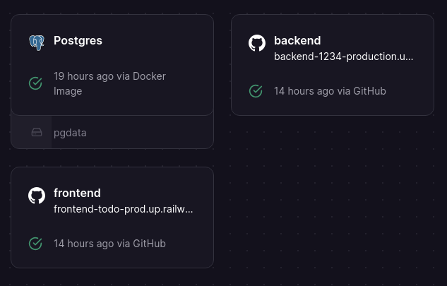

# Todo list

Technology stack:

- TypeORM
- Node.js
- Express
- Tailwind
- React Query
- Next.js
- Docker
- PostgreSQL
- Eslint
- Prettier

## Running localy

First install this project on your machine localy. On both client and server sides there's a same command to run them in dev environment:

    npm run dev

In order to run client and server, you should navigate to each one of them and run command above.

There are also several commands like `npm run start`, `npm run lint` and so on but those are primarily used by **setup.sh** script and **dockerfile** in order to prepare the project for deployment.

Also, in order to connect to the database you would have to setup environment variables by yourself.

## Technologies

For fetching data I decided to go with simple `fetch` function and React Query library for lightweight data querying. At some point I thought about using Redux for state management and Redux Saga to handle querying side effects, but those would require a lot more redundant and repetitive code for this app. Also, debouncing is emplemented in order to not overload both server and client with search requests and UI updates.

Server had set up with Node.js along with Express. Apart from that I decided to use **ts-node** package to be able to write Node.js server in TypeScript code and then compile it to ordinary JavaScript via `npm run build` command.

Process of handling route requests is split in three stages:

1. Routes - match path and HTTP verb with corresponding controller
2. Controllers - extract data from request object and pass the data to services
3. Services - use TypeORM entities to access a database

Formatting and linting are handled by Eslint and Prettier respectively. Both of those comply with each other, throwing an error if linting rules are not met and auto formatting code in order to met those rules.

## Deploying

For this project I had chosen Railway as a hosting provider and Docker in order to deploy client, backend and postgres services.

Both server and client services are generated via **dockerfile**. On the server side though, there's also a **setup.sh** script, which installs dependencies and runs TypeScript compiler. On the client side all of those build processes are done via **dockerfile** alone.

An overall architecture looks like this:

